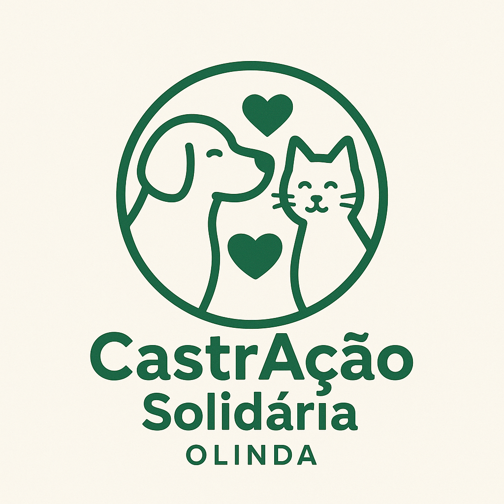

  

# CastrAção Solidária – Olinda 🐾

**Projeto voluntário e solidário que facilita a castração gratuita de cães e gatos de Olinda.**

---

## 🌟 Sobre o projeto
Atualmente, **Olinda não conta com um hospital veterinário público de grande porte**, como o Hospital Veterinário do Recife (HVR), que dispõe de maior capacidade e regularidade de atendimento.  
Na cidade, as ações de castração geralmente ocorrem por meio de **campanhas de castramóvel pontuais**, muitas vezes sem frequência contínua.  

Diante desse cenário, o **CastrAção Solidária – Olinda** organiza vagas no programa gratuito do Recife, ajudando tutores a garantir o bem-estar de seus animais de forma contínua e solidária.

---

## 🎯 Objetivos
- Reduzir a população de animais abandonados.  
- Fornecer informações de cuidados pré e pós-operatórios.  
- Engajar a comunidade em ações solidárias.

---

## 🐶🐱 Como funciona
1. Tutor realiza inscrição via [formulário online](https://forms.gle/ZneHW82XMKsnUj6s5).  
2. Aguarde nosso contato confirmando a vaga.  
3. Projeto agenda a castração em Recife.  
4. Leve seu animal no dia e horário agendado (**transporte é responsabilidade do tutor, mas um voluntário do projeto acompanhará o processo no local**).  
5. Tutor recebe instruções detalhadas de cuidados pós-operatórios.  
6. **Observação:** Cada tutor pode cadastrar **apenas 1 animal por mês**.

---

## 👥 Público-alvo
- Tutores de baixa renda em Olinda.  
- Protetores independentes que resgatam animais.

---

## 📄 Documentos
- [Termo de responsabilidade do tutor](docs/tutor_termo.md)

---

## 🤝 Como contribuir
- Compartilhe o projeto nas redes sociais.  
- Ajude com transporte voluntário.  
- Sugira melhorias via [Issues](../../issues).  

---

## 📬 Contato
- Email: castracaosolidaria.olinda@gmail.com  
- Instagram/Facebook: [@castracaosolidariaolinda](https://www.instagram.com/castracaosolidariaolinda)

---

Projeto desenvolvido por voluntários apaixonados por animais 🐾

